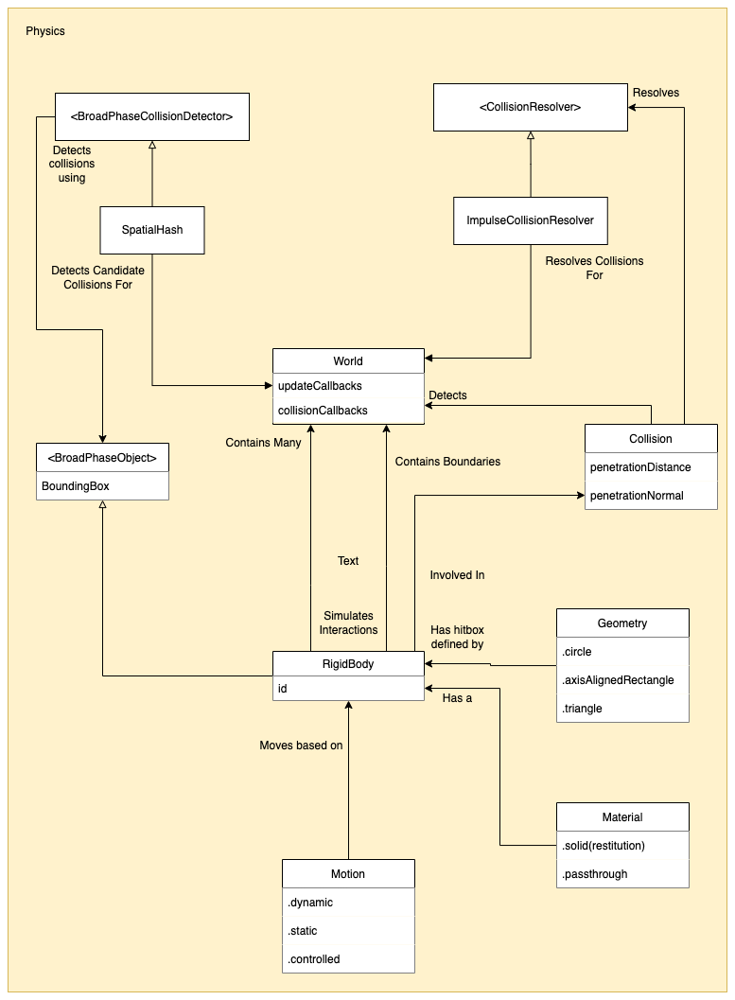
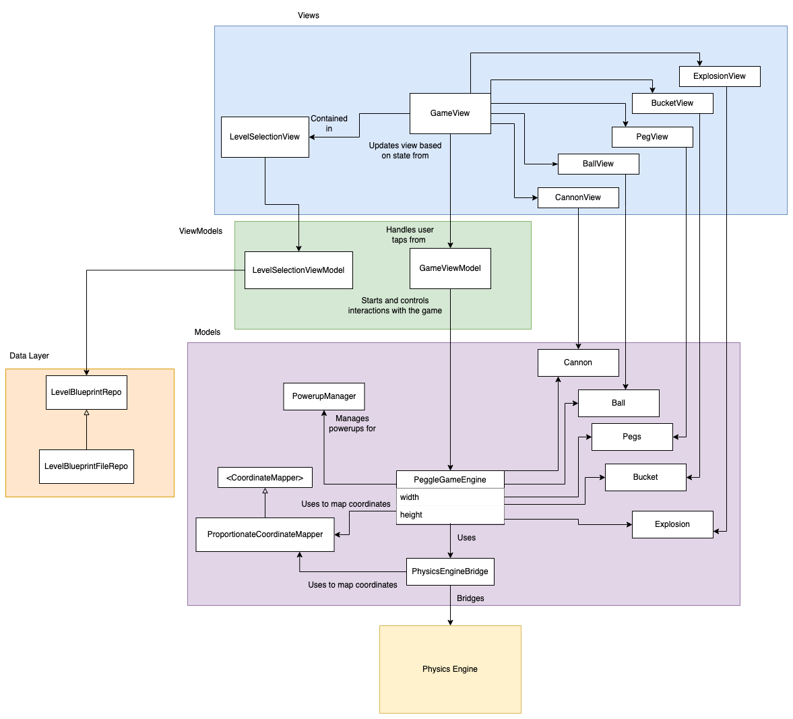
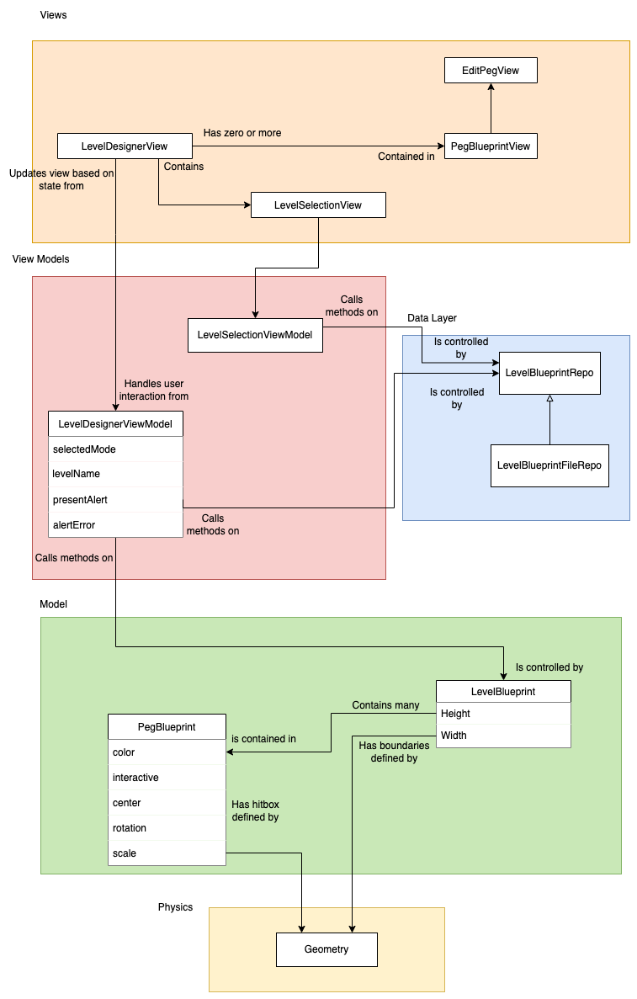

# CS3217 Problem Set 4

**Name:** Huang Weijie

**Matric No:** A0190270M

## Tips
1. CS3217's docs is at https://cs3217.github.io/cs3217-docs. Do visit the docs often, as
   it contains all things relevant to CS3217.
2. A Swiftlint configuration file is provided for you. It is recommended for you
   to use Swiftlint and follow this configuration. We opted in all rules and
   then slowly removed some rules we found unwieldy; as such, if you discover
   any rule that you think should be added/removed, do notify the teaching staff
   and we will consider changing it!

   In addition, keep in mind that, ultimately, this tool is only a guideline;
   some exceptions may be made as long as code quality is not compromised.
3. Do not burn out. Have fun!

## Dev Guide

### Project Structure

The source code for this application is divided into two major parts, the Physics engine
and the Peggle game itself.

The root directory of this repository is an XCode workspace, with the Physics engine in the
`Physics/` directory as a standalone Swift Package, and the Peggle game in the `Peggle/`
directory as a XCode project.

The source files in `Physics/` are arranged according to broad Physics concepts, with the
main entrypoint for clients being the `World` class in `Physics/World.swift`.

The source files in `Peggle/` are arranged according to a general MVVM structure, with different
folders with Views, ViewModels, Models, and others.

### General App Architecture

Generally, the application follows a MVVM architecture for the displays. The Physics engine package
handles all concerns related to simulating realistic physics. The logic for the game and the game designer (the "domain logic")
are mostly in the models. The views present the state in the models for various UI components, and the view models
are a thin layer that mediate the interaction between the models and the view.

### Physics Engine High Level Overview

The goal of the Physics engine is to simulate realistic physics motions for a set of rigid bodies. The engine:

- Can simulate gravity.
- Can handle collision detection, as well as resolving collisions between bodies.
- Supports bodies that collide, or pass through one another.
- Can simulate inelastic collisions (where energy is lost as heat).
- Can have unpassable boundaries on any of the left, right, top and bottom directions.
- Can simulate:
  - *dynamic* objects that behave like objects in the real world do
  - *static* objects that behave like some obstacles in games - immovable with seemingly infinite mass
  - *controlled* objects that behave like obstacles in games that move along a pre-determined path
- Exposes a set of callbacks, to allow clients to be notified of changes to bodies.

The non-goals of the engine is as follows:
- Only simulates *rigid* bodies that cannot be compressed or deformed
- Does not simulate friction or drag
- Does not simulate rotational or angular motion

The following is a high-level outline of the significant entities (ie. classes, structs, enums) used in the physics engine.

**`World`**

`World` is the top level class that orchestrates the physics simulation. Clients can add and remove
`RigidBodies` to and from the engine, along with callbacks that are fired when those bodies are updated.
Clients can also add boundaries to each direction (left, right, top, and bottom) of the world

To run the simulation, clients should call the `.update(dt: Float)` method and pass in a sufficiently 
small time interval. The simulation will then step forward by that time interval and run all the appropriate
simulations for that interval. Calling the update method ~30 to ~60 frames a second tends to result in smooth
simulations.

Each time the update method is called, the world has to run 4 major steps, in order:

1. Update the motion of every rigid body in the world. This means accounting for
   forces applied, velocity, and the body's current positions.
   
2. Check for collisions between all pairs of rigid bodies.
  This can be split into 2 phases, for performance, instead of brute forcing all pairs.
  - **Broad phase**: Generate *possible* groups of collisions
  - **Narrow phase**: Brute force each possible group to find the actual collisions
  
3. Resolve collisions by updating the motion of bodies such that they
   move away from each other in the next time step. If the time steps are
   small enough, this should result in realisitic collisions.
   
4. Send relevant callbacks to subscribers.

**`RigidBody`**

Every "object" inside the Physics world is represented as a `RigidBody`, which is updated on
every step of the world. `RigidBody` is very simple class which composes together various
other lower-level classes like `Geometry`, `Motion`, and `Material`. As a result, `RigidBody`
delegates most of its behavior to other entites, and the behavior of a `RigidBody` object can
be customized by swapping those entites out.

#### Collisions

Collisions involves 2 major areas, collision detection and collision resolution.

**`BroadPhaseCollisionDetector`**

As mentioned above, collision detection is done in two phases for performance, a
broad phase and a narrow phase. The `BroadPhaseCollisionDetector` is a protocol
which allows various `BroadPhase` objects to be added, updated and removed.

It can then return the list of candidate collision groups.

`SpatialHash` is a concrete implementation of this protocol which uses a spatial hash
to narrow down possible collisions.

**`Geometry`**

`Geometry` is an enum defining different shapes of geometry. It also contains the logic
required to detect collisions between each case of a geometric shape. This is how
narrow phase collision detection is done in this Physics engine. The rationale for why
`Geometry` is an enum has been covered in Problem Set 2's developer guide.

**`CollisionResolver`**

Collisions between objects must be resolved by pushing the objects apart somehow.
`CollisionResolver` is a protocol which defines 1 method that should be used to
resolve a given collision.

`ImpulseCollisionResolver` is a concrete implementation of this protocol which uses
impulses to resolve the collisions.

#### Dynamics

Dynamics determines how objects in the simulation move.

**`Motion`**

`Motion` is an enum that defines how objects move and react to external forces. There
are three cases, `dynamic`, `static` and `controlled`.

Dynamic objects react like normal objects in the real world. Their velocity can be affected
by external forces and impulses.

Static objects react like immovable game obstacles. They have a constant velocity, and forces
and impulses do not affect them.

Controlled objects move along pre-defined controlled routes. Their position can be controlled
by user defined code, and their velocity is based of their instantaneous change in position.
Forces and impulses also do not affect them.

### Peggle Game High Level Overview

The following is a high-level outline of the significant entities (ie. classes, structs, enums) used in the physics engine.

#### Models

There are various structs that represent each game object and encapsulate their logic. These include:

- `Peg`
    - Interactive pegs are your standard pegs that light up when hit, and are removed at the end of the round
    - Non-interactive pegs are your blocks, that function mainly as obstacles
- `Ball`
- `Cannon`
- `Bucket`
- `Explosion`

**`PeggleGameEngine`**

`PeggleGameEngine` orchestrates between the above game objects and the Physics engine to run the game.
It is in charge of encoding higher level game logic that cannot be represented in the Physics engine.
Examples include:

- Initiating the firing of the ball
- Checking to see if the ball is out of bounds
- Removing pegs and allowing the cannon to fire again if the ball is out of bounds.
- Coordinating between the physics engine and the game objects.
- Logic for powerups such as moving the ball for the Spooky powerup and creating explosions
  for the Kaboom powerup.

Similar to the Physics engine, `PeggleGameEngine` should be run by calling the `.update(dt: Float)`
method to progress the simulation forward by that timestep.

**`CoordinateMapper`**

`CoordinateMapper` is a protocol which maps coordinates from a local coordinate system to an
external coordinate system. Handling the mismatch between coordinate systems is an important
issue as the `PeggleGameEngine` and the physics engine run on their own set of coordinate
systems, while clients may have different coordinate systems.

For example, iOS has the 0 y-coordinate at the top-most point, while the physics engine has it flipped.

`ProportionateCoordinateMapper` is a concrete implementation of that protocol which maps coordinates
in a proportionate manner along both axes.

**`PowerupManager`**

`PowerupManager` is a dependency of the `PeggleGameEngine` that helps to manage the activated powerups. It is
in charge of keeping track of what powerups are active and removing the powerups when they have expired. It will
also apply any active powerups every tick.

The powerups themselves (ie. Spooky Powerup or Kaboom Powerup) contain the logic of how to update the game when
they are triggered. For example, the Spooky powerup checks for the position for the ball every tick, and transports
the ball to the top if the ball is ever out of bounds.

**`PhysicsEngineBrige`**

Simple class that bridges between the Peggle game engine and the physics engine. Helps to keep track of insertion/removal
of rigid bodies for each type of game objects, and also simplifies most of the mapping of coordinates in one place.

#### ViewModels and Views

The game has 1 main view and 1 main view model supporting that view. The view simply shows the
running game, and allows the user to fire the cannon at the appropriate times. There are also
several subviews that ecapsulate separate functionality, like the `GameMenuView` and `LevelSelectionView`.

**`GameViewModel`**

`GameViewModel` is a simple view model that mainly initializes the game engine, and starts the game
loop by hooking into `CADisplayLink`. Once the game loop starts, the game mostly runs on its own,
and updates to the game objects are propagated via implementing the `ObservableObject` protocol.

Each time the game engine updates objects, it runs a callback that the view model passes it. This
callback is used to
[manually publish updates via the `objectWillChange` property](https://www.hackingwithswift.com/quick-start/swiftui/how-to-send-state-updates-manually-using-objectwillchange).

Finally, `GameViewModel` exposes 1 method, `.fireBallWith(cannonAngle: Degrees)` for the view to
call when the cannon has been tapped by the user.

**`GameView`**

`GameView` is the view that displays the running game. It has multiple sub-views to display each
game object, such as `PegView`, `BallView` and `CannonView`. The view is rather simple and only
has one notable point of interaction, where users tap on the rotating cannon the fire the ball
in the direction the cannon is facing.

### Peggle Level Designer High Level Overview

The following is a high level overview of the significant entities (ie. classes, 
structs, enums) used in the level designer segment of the app:

#### Models

**`LevelBlueprint`**

`LevelBlueprint` is the representation of a Peggle level created by the level designer.
In the context of a level designer, the blueprint must have the following capabilities:

- Contain a collection of game objects, called `Peg`s, and support the adding and
  removal of pegs.
- Have a coordinate system, as the pegs are placed at specific points on the level,
  and the level has boundaries based on what is displayed on the screen.
- Able to check if a given peg placement is valid, ie. pegs that overlap with other
  pegs or the boundaries of the level are invalid.
  
Given that, the `LevelBlueprint` has a width and height with origin at (0, 0) to mimic
a 2D coordinate system, and an internal data structure to manage the pegs placed.

The height of the level can be updated to accomodated for arbitrarily tall levels.

It also has methods for adding pegs, removing pegs, as well as checking if a peg
can be placed at a particular spot.

Checking if the peg can be placed at a particular spot requires some hitbox collision
detection logic, which is implemented by `Geometry`.

**`PegBlueprint`**

`Peg` is the representation of peg blueprints that are placed on the level via the level designer.
Each peg has a color, is centered on a particular point, and has a certain hitbox, based
on the type of peg. For now, round and triangular pegs are supported.

These pegs can be rotated and resized by clicking on the peg in the level designer to open an
`EditPegView` which exposes sliders to control the rotation angle and scale of the peg.

**`RelativelySized`**

`RelativelySized` is a protocol that determines how each game object should be sized relative to
each other. This allows for a semi-consistent diplay of the game on various screen sizes.

Since aspect ratios of screens can differ, we do not define the relative size in 2 dimensions, 
as that would lead to warped aspect ratios for some game objects. Instead, we only allow Peggle
to be played on portrait oriented views, and we compare the relative sizes of game objects by
their widths, which is the more limiting axis for portrait oriented views.

This leads to the game objects having *roughly* the same relative size.

#### ViewModels and Views

The level designer has 1 main view and 1 main view model supporting that view. It also has several
sub-views that help to encasulate logic, such as the `EditPegView`. The requirements of
these views are:

- Add, remove and move around pegs on the screen based on different gestures
- Change between different modes of adding pegs of different colors, and removing pegs
- Editing existing pegs on the blueprint by changing their rotation/size
- Saving, loading, and resetting the level blueprint

**`LevelDesignerViewModel`**

`LevelDesignerViewModel` is the view model handling all the above requirements. It implements the
`ObservableObject` protocol, which allows SwiftUI to know to re-render the view when any of its
`@Published` attributes change. This is used to propagate changes in the model back to the view.

It interacts with a `LevelBlueprint`, and exposes methods for the view to call to mutate the
blueprint depending on the gesture taken.

It also tracks the current edit mode selected by the user, and changes the behavior of methods
based on it.

Lastly, it also interacts with the data layer, to handle the save and load logic when the
corresponding buttons are pressed on the view.

**`LevelDesignerView`**

The main view for the level designer. It displays the controls at the top, followed by the level
blueprint where pegs can be added below the controls. The state to be rendered (ie. what pegs should
be rendered) is all within the `LevelDesignerViewModel`. When published attributes in the view model
changes, SwiftUI re-renders this view with the updated data.

**`PegBlueprintView`**

A view for an individual peg blueprint. Handles how to properly display the peg and the callback logic
for all the gestures that can be made on a peg. Also handles the logic of animating the "drag to move peg"
action.

**`EditPegView`**

Encapulates the view code that allows players to edit pegs in the level designer. When a peg is tapped,
an edit panel is shown with sliders to control the editable components of a peg blueprint.

#### Data Layer

**`LevelBlueprintRepo` and `LevelBlueprintFileRepo`**

`LevelBlueprintRepo` is a protocol that defines the signature of how a level blueprint should be 
loaded and saved. `LevelBlueprintFileRepo` is a concrete implementation of that protocol that saves
and loads level blueprints as JSON encoded files. It is called by the view model when the "save" or
"load" buttons are pressed.

### Class Diagram

Below is a high-level class diagram outlining the interactions between entities.

#### Physics Engine

#### Peggle

#### Level Designer

## Rules of the Game

### Cannon Direction

The cannon is located at the top of the level and swivels from left to right repeatedly.

To fire a ball in a particular direction, tap on the cannon as it swivels.
The cannon should fire the ball in the direction where it was aiming when you tapped it.

### Win and Lose Conditions

At the start of each game, you are given 10 balls. A player wins by removing all
orange pegs from the level before all 10 balls have run out. All pegs hit by the
ball will be removed when the ball goes out of bounds.

If all 10 balls have run out and there are still orange pegs on the level, the game
is lost.

### Handing Ball Stuck

If the ball has not hit a new peg in this round for more than 15 seconds, the engine will
guess that the ball is stuck and randomly remove one peg that has already been hit, with
the assumption that one of the pegs that has been hit must also be one of the pegs that
is blocking the ball from advancing.

### Explosions

Explosions can be triggered by hitting a green peg with the "Kaboom" powerup selected.
An explosion immediately removes all pegs *and* blocks in the area of effect of the explosion.

## Level Designer Additional Features

### Peg Rotation

In the level designer, click on a peg to open up the peg edit panel. The top of the two
sliders controls the rotation of the selected peg. Slide the slider to rotate the peg
from 0 to 360 degrees.

### Peg Resizing

In the level designer, click on a peg to open up the peg edit panel. The bottom of the two
sliders controls the scale of the selected peg. Slide the slider to scale the peg from 1x
the area to 2.5x the area.

### Scrolling Levels

In the level designer, click on the downward arrow at the bottom of the screen to pan downwards
and extend the height of the level.

## Bells and Whistles

### Sound and music

Added background music for the level designer, menu, and game screens.

Also added sound effects for various gameplay events, such as explosions, collisions,
and win/loss sounds.

## Tests

### Integration Tests Palette

The tests below should be done on different screen sizes in portrait and upside-down portrait orientations,
for exhaustiveness (Game does not support landscape).

#### General Tests

- When clicking start game from the level designer, then opening the game menu and clicking back, should:
  - Return to the level designer and still show the previous level blueprint that the user was editing
  - Instead of going back to the menu
  
- When starting a game directly from the menu, then opening the game menu and clicking back, should:
  - Navigate back to the menu instaed of going to the level designer
  
#### Level Designer Tests

- Level Blueprint (with background image and where pegs are placed), in add peg mode.
  - When tapped at an arbitrary spot where the new peg would not overlap with anything, it should:
    - Have a peg appear centered at the spot that was tapped
    - The new peg that appears should be the same color as the one specified in the add peg mode.
    
  - When tapped at a spot where the new peg would overlap with the old peg, it should:
    - Have nothing happen
    
  - When tapped at a spot where the new peg would overlap with the boundaries of the level, it should:
    - Have nothing happen

- Level Blueprint, in remove peg mode.
  - When tapped at a spot with no pegs, it shoud:
    - Have nothing happen
    
  - When tapped on top of an existing peg, it should:
    - Cause the tapped peg to be removed
    
- Any arbitrary peg
  - When normal tap on the peg, it should:
    - Open up the edit peg panel, with two sliders.
    - When sliding the rotation slider, it should:
        - Have a semi-transparent "peg preview" replace the peg view, and rotate along with the sliding
        - When the slider is released, if the peg preview is not overlapping another peg or boundary, it should:
            - Replace the preview with the actual peg, rotated the correct amount
        - When the slider is released, if the peg preview *is* overlapping another peg or boundary, it should:
            - Replace the preview with the actual peg, but not rotated
            - Have the slider reset back to a valid configuration
            
    - When sliding the resizing slider, it should:
        - Have a semi-transparent "peg preview" replace the peg view, and scale in size along with the sliding
        - When the slider is released, if the peg preview is not overlapping another peg or boundary, it should:
            - Replace the preview with the actual peg, scaled in size to the correct amount
        - When the slider is released, if the peg preview *is* overlapping another peg or boundary, it should:
            - Replace the preview with the actual peg, but not scaled in size
            - Have the slider reset back to a valid configuration
            
    - When there is another tap outside of the slider in the blueprint, or a tap on the close button of the slider, it should:
        - Close
        
    - If the user changes the edit mode, it should:
        - Close the slider

  - When long pressed on the peg, it should:
    - Cause the long pressed peg to be removed

  - When dragged, it should:
    - Show a copy of the peg but with lighter opacity following the drag location
    - Have the original peg disappear
    - When the drag stops, it should:
        - If the location where the drag stops overlaps with the boundaries of the level or another peg,
          the peg with lighter opacity should disappear, while the original peg should appear back at its
          previous location.
        - If the location where the drag stops does not ovelap with the boundaries of the level or another peg,
          the peg with lighter opacity should disappear, and a new peg should appear at the spot where the drag
          stops.
          
- "Reset" button
  - When tapped while there are pegs on the board, it should:
    - Cause all existing pegs to be removed

  - When tapped while there are no pegs on the board, it should:
    - Have nothing happen
    
- "Load" button
  - When "Load" tapped, it should:
    - Display the level selection popup
  - When level selected in the level selection popup and "Confirm" pressed, it should:
    - Return to the level designer with the selected level blueprint on the screen
  - When level not selected in the level selection popup and "Cancel" pressed, it should:
    - Return to the level designer with the previous level blueprint on the screen
    
- "Save" button
    - When "Save" tapped, it should:
        - Display a save dialog to enter the name of the level to be saved
        - If the level blueprint already has a name (ie. if it was loaded), it should:
            - Autofill the name text field with the name of the level blueprint
        - If the level blueprint does not have a name, it should:
            - Autofill the name text field with "Custom Level".
        - When clicking "Save" with a level name field in, it should:
            - Save the level, rename the current level blueprint to the saved name, and return
        - When clicking "Save" with an empty or whitespace level name, it should:
            - Not save the game, and show an error dialog

#### Game Tests

- Game View
  - When the game starts, the cannon should already be rotating back and forth at various angles
  - When the game starts, the bucket should already be moving back and forth at the bottom of the leve.

  - When cannon is tapped at various angles, ball should:
    - Be fired in the same direction as the cannon was facing
    - Especially test the edge cases where the angle is near 0 or 180 degrees to ensure the ball cannot fire upwards

  - When cannon is tapped, the cannon should:
    - Disappear partially

  - When ball hits a peg, the peg should:
    - Not move
    - Light up if it has not been hit before
    - If the peg is green (a powerup peg) and has not been hit already,
        - The selected powerup should activate
    
  - When ball hits a block, the block should:
    - Not move
    - Not light up

  - When ball hits the top, left, or bottom boundaries or a peg, the ball should:
    - Bounce off in a sensible manner

  - When ball hits the bottom of the screen, the ball should:
    - Not bounce off
    - Disappear

  - After ball disappears from the bottom of the screen:
    - All pegs that were hit should disappear
    - No peg that was not hit should disappear
    - The cannon should reappear and start rotating again
    
  - If the ball is stuck:
    - After 15 seconds, a peg that haas been hit should be removed from the level
    
  - On levels where the height is taller than the screen height,
    - When the ball falls below the top half on the screen, the camera should:
      - Pan downwards to follow the ball such that the ball remains in the top half of the screen
      - Unless the bottom of the level has been reached
    - When the ball rises above the bottom 70% of the screen, the camera should:
      - Pan upwards to follow the ball such that the ball remains in the bottom 70% of the screen
      - Unless the top of the level has been reached

## Written Answers

### Reflecting on your Design

> Now that you have integrated the previous parts, comment on your architecture
> in problem sets 2 and 3. Here are some guiding questions:
> - do you think you have designed your code in the previous problem sets well
>   enough?
> - is there any technical debt that you need to clean in this problem set?
> - if you were to redo the entire application, is there anything you would
>   have done differently?

In my opinion, my attempts at designing the code in PS2 and 3 were decent but not perfect.
In general, most new requirements in problem set 4 could be implemented by extending the code
instead of modifying it, such as when implementing the bucket's movement. When rewrites were
needed, the logic was also generally simple and the files were the rewrites were required were
rather localized.

Nonetheless, there were definitely areas where the code could have been better organized and cleanly
separated into smaller, more modular units. When nearing the end of the implementation, I began to
feel the size of some classes started to push against my own cognitive limits and it was hard to quickly
get a sensing of what the class did.

Below are some specific points I think are worth highlighting.

The good:

- My usage of enums for a variety of entities like `Geometry` and `Motion` was a bit of an experiment, as the
  previous time I had used enums like that was in Java a few years back. I did find it in generally to be quite
  effective, with the compiler enforced exhaustiveness checks and refactorings making it very easy to add new 
  cases to extend the behavior of my entities, such as when adding a `.triangle` geometry or a `.controlled` motion.
  In a way, it worked a lot like discriminated union patterns from functional programming, which I quite like.

- I made a point to avoid inheritance as much as possible for these problem sets and I felt it worked out well. I never
  felt there was a situation where I would have needed to use inheritance to help make my code DRY, and I avoided many
  of the pitfalls of using inheritance. Instead, the main technique I used was composing behaviors from various enums
  and structs in a parent struct/class, which felt way more flexible.
  
The bad:

- While I found that my idea to use a coordinate mapper was decent, my implementation of it was brittle and I did not
  properly scope out the actual implications of using such a system. As a result, the usage of it is rather awkward
  (many calls to `mapper.localToExternal` all over the place), and there were several many pitfalls regarding its usage
  that I fell into, which I had to then spend time debugging.
  
- The Peggle game engine's coded houses almost all of the game's logic, and thus got rather bloated near the end. While
  I attempted to extract some code out (ie. `PhysicsEngineBridge` and `PowerupManager`), the bulk of the logic was still
  inside that one class, and it was a little difficult to refactor.
  
In terms of tech debt, the most pressing tech debt I would like to address are the two bad points I mentioned above.
Making the coordinate system a first class member of the mathematics of the physics and game engines may be a better
approach compared to the tacked-on approach I went with. Also, making the Peggle game engine leaner from the start may be
a better approach. Instead, the logic would live in the subcomponents like the ball, peg and bucket structs, and they would
interact with the game engine by calling general purpose methods.

Other tech debt involves a rather messy design system for the UI, as I was very unfamiliar with how to create
an extensible design system from scratch in SwiftUI. Given more time, that would be something I would focus on
more, as it would give me the ability to more easily update and change the theme of the app.
